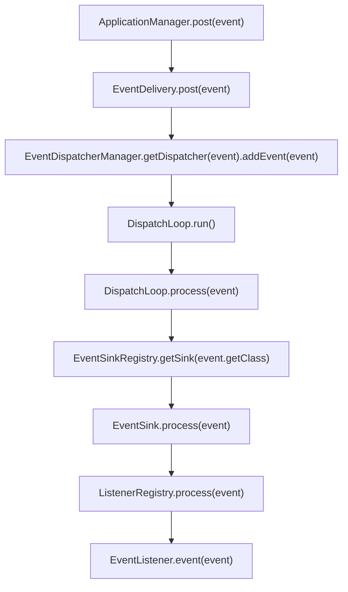

> `ONOS` 中的 `Event Subsystem`。

<!-- more -->
* TOC
{:toc}

## 基本结构

```mermaid
graph TD;

a0["ApplicationManager.post(event)"];
a1["EventDelivery.post(event)"];
a2["EventDispatcherManager.getDispatcher(event).addEvent(event)"];
a3["DispatchLoop.run()"];
a4["DispatchLoop.process(event)"];
a5["EventSinkRegistry.getSink(event.getClass)"];
a6["EventSink.process(event)"];
a7["ListenerRegistry.process(event)"];
a8["EventListener.event(event)"];
a0 --> a1;
a1 --> a2;
a2 --> a3;
a3 --> a4;
a4 --> a5;
a5 --> a6;
a6 --> a7;
a7 --> a8;
```
