> 各种树

<!-- more -->
* TOC
{:toc}

## 1. 树

树是一种非线性结构，包含 n 个节点和 n-1 条边。之所以叫树，是因为其形状像一棵倒挂的树。

***基本的树形结构***

### 1.1 树的基本概念

树（Tree）是一种逻辑结构，用于描述具有层次关系的数据集合。

对于有 n (n >= 0) 个节点的树：

* 树结构的每个元素都称为节点；
* 每个节点都有0个或多个子节点；
* 没有父节点的节点称为根节点；
* 没有子节点的节点称为叶子节点；
* 当 n = 0 时，称为空树；
* 当 n > 0 时，树有且仅有一个称为根节点；
* 当 n > 1 时，树的根节点以外的节点，可以分成 m （m < n) 个互不相交的树，这些树都称为根的子树。

### 1.2 与树有关的术语

***树的相关术语***

| 术语     | 说明                                                                       |
| -------- | -------------------------------------------------------------------------- |
| 节点     | 树中的每一个元素都称为一个节点                                             |
| 边        | 父子节点之间的连接称为边                                                 |
| 根节点   | 每一棵树都从一个节点出发，该节点称为树的根节点                             |
| 子节点   | 从一个节点引申出的节点称为该节点的子节点                                   |
| 内部节点 | 除了根节点和叶子节点以外的其他节点                                        |
| 兄弟节点 | 从同一个节点直接引申出的节点互为兄弟节点                                   |
| 度       | 一个节点的子节点个数称为该节点的度，一颗树中所有节点的度的最大值称为树的度 |
| 阶       | 树的度也称为树的阶，即所有节点的度的最大值                             |
| 叶子节点 | 度为 0 的节点称为叶子节点                                                  |
| 层次[^tree_layer]     | 根节点为第一层，根节点的子节点为第二层，子节点的子节点为第三层，以此类推   |
| 深度     | 一棵树的所有节点的最大层次，称为树的深度                                   |
| 路径     | 从一个节点到达另一个节点所途径的所有节点构成序列称为路径                   |
| 路径长度 | 两个节点的路径上所有边的个数（加权值）称为路径长度                         |

[^tree_layer]: 关于层次，不同的教材说法不一，本文采用根节点为第1层这种方式。

### 1.3 树的性质

树具有如下基本性质：

* 树的节点数等于树的所有节点的度之和加一 (**所有节点的度 + 一个根节点**)
* 度为 m 的树在第 i 层上最多有 $m^(i-1)$ 个节点 (i > 1)
* 高度为 h 度为 m 的树，最多有 $(1 - m^h)/(1 - m)$ 个节点 (**等比数列之和**)
* 具有 n 个节点的度为 m 的树，最小高度为 $log_m(n(m-1)+1)$

## 2. 二叉树

二叉树是度为2的树，是树的一种特例。它规定每一个节点最多有两个子节点，分别称为左子节点和右子节点；以左子节点和右子节点为根节点的子树，分别称为该节点的左子树和右子树。

### 2.1 二叉树的性质

二叉树有如下的性质：

* 每一个节点最多有两个子节点；
* 第 i 层节点数最多为 $2^(i-1)$;
* 一颗高度为 n 的二叉树其节点数最多为 $2^n-1$。

### 2.2 二叉树的遍历

根据遍历时处理根节点的位置不同，可以将二叉树遍历分为三种：

1. 先序遍历，先根节点，然后左子树，最后右子树；
2. 中序遍历，先左子树，然后根节点，最后右子树；
3. 后序遍历，先左子树，然后右子树，最后根节点。

二叉树的遍历有多种方法，主要包括递归遍历、非递归遍历和Morris遍历。

#### 2.2.1 二叉树的递归遍历算法

二叉树的遍历过程，本身是递归的（对每一棵子树），因此基于递归的遍历算法实现起来也最为简单和自然。

##### 先序遍历

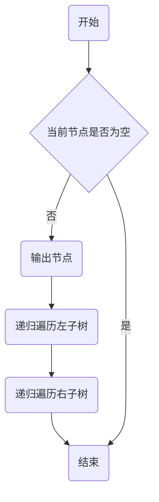

二叉树的递归先序遍历步骤如下：

1. 初始化当前节点为根节点。
2. 当前节点为空，返回。
3. 当前节点不为空时，执行以下操作：
   * 输出当前节点。
   * 递归遍历当前节点的左子树。
   * 递归遍历当前节点的右子树。

##### 中序遍历

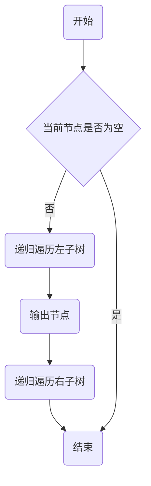

二叉树的递归中序遍历步骤如下：

1. 初始化当前节点为根节点。
2. 当前节点为空，返回。
3. 当前节点不为空时，执行以下操作：
   * 递归遍历当前节点的左子树。
   * 输出当前节点。
   * 递归遍历当前节点的右子树。

##### 后序遍历

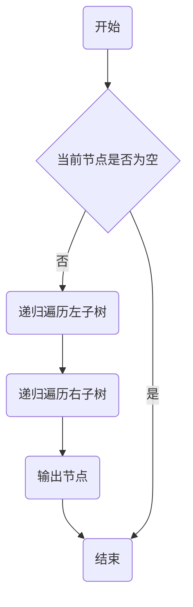

二叉树的递归中序遍历步骤如下：

1. 初始化当前节点为根节点。
2. 当前节点为空，返回。
3. 当前节点不为空时，执行以下操作：
   * 递归遍历当前节点的左子树。
   * 递归遍历当前节点的右子树。
   * 输出当前节点。

#### 2.2.2 二叉树的非递归遍历算法

递归遍历，简单易实现，缺点也明显，递归调用占用栈空间。栈调用层次过多时，可能发生栈溢出。

非递归的遍历算法，借助额外的栈来实现。

##### 非递归先序遍历

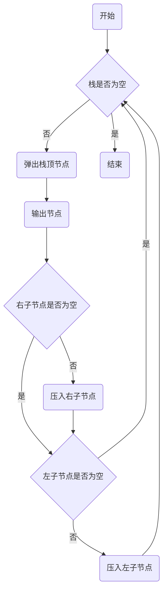

二叉树的非递归先序遍历步骤如下：

1. 创建一个辅助栈，将根节点压入栈。
2. 当栈不为空时，执行以下操作：
   * 从栈中弹出一个节点，输出该节点。
   * 如果该节点的右子节点不为空，将右子节点压入栈。
   * 如果该节点的左子节点不为空，将左子节点压入栈。
3. 重复步骤2，直到栈为空。

这种方法的思想是先访问树的深层节点，所以需要先将右子节点压入栈，保证左子节点先被访问。

##### 非递归中序遍历

***非递归中序遍历流程图***

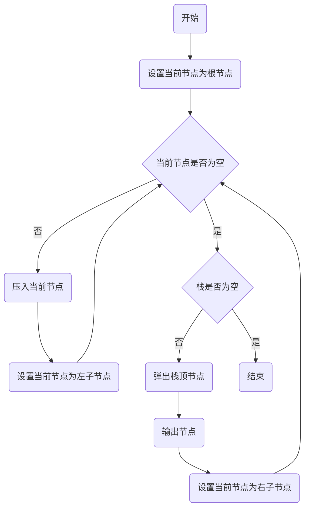

二叉树的非递归中序遍历步骤如下：

1. 创建一个辅助栈，初始化当前节点为根节点。
2. 当栈不为空或者当前节点不为空时，执行以下操作：
   * 如果当前节点不为空，将当前节点压入栈，然后将当前节点设置为其左孩子。
   * 如果当前节点为空，说明已经到达了某个节点的最左边，此时应该开始回溯。从栈中弹出一个节点，输出该节点，然后将当前节点设置为该节点的右孩子。
3. 重复步骤2，直到栈为空且当前节点也为空。

##### 非递归后序遍历

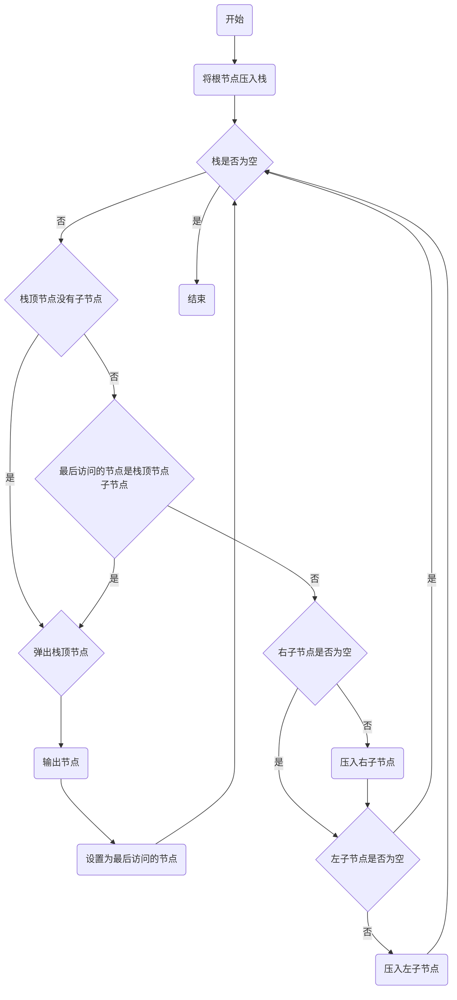

二叉树的非递归后序遍历步骤如下：

1. 创建一个辅助栈，将根节点压入栈。
2. 创建一个变量 lastVisit 来记录上一次访问的节点。
3. 当栈不为空时，查看栈顶元素 node。
   * 如果 node 的左右子节点都为空，或者 node 的子节点是最后访问的节点，那么可以直接输出 node 节点，将 node 节点出栈，然后将 lastVisit 设置为 node。
   * 否则，先将 node 的右子节点压入栈（如果不为空），再将 node 的左子节点压入栈（如果不为空）。
4. 重复步骤3，直到栈为空。

这种方法的思想是先访问树的深层节点，所以需要先将右子节点压入栈。

#### 2.2.3 二叉树的 Morris 遍历算法

Morris 遍历算法是一种不需要使用额外空间的二叉树遍历方法。它利用了二叉树中的空闲指针（即叶子节点的左右空指针）来实现常数空间复杂度的遍历。

注意：Morris 遍历算法的实现较为复杂，需要对二叉树的结构有深入理解。在实际应用中，如果不特别关注空间复杂度，通常使用递归或非递归的遍历算法。

##### Morris 先序遍历

***Morris 先序遍历流程图***

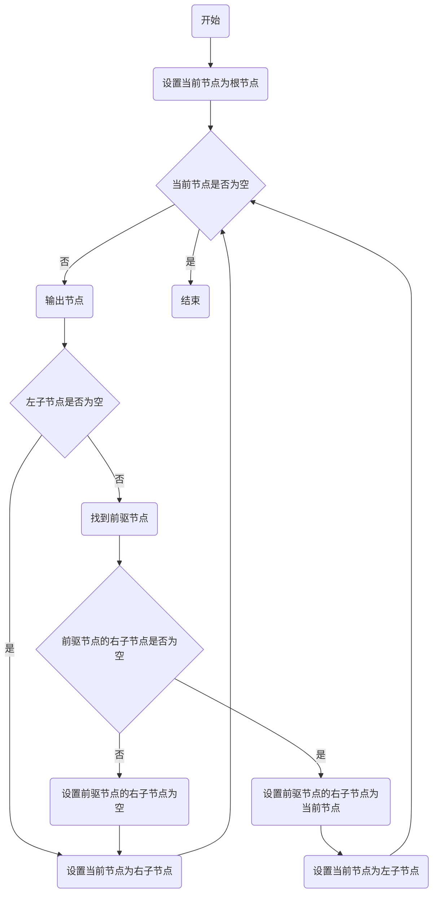

Morris 先序遍历的步骤如下：

1. 初始化当前节点为根节点。
2. 如果当前节点的左孩子为空，输出当前节点并更新当前节点为右孩子。
3. 如果当前节点的左孩子不为空，找到当前节点左子树的最右节点（这个节点也是当前节点的前驱节点）。
   * 如果前驱节点的右孩子为空，将它的右孩子设置为当前节点。输出当前节点（在这里输出，这就是与中序遍历唯一一点不同）。当前节点更新为当前节点的左孩子。
   * 如果前驱节点的右孩子为当前节点，将它的右孩子重新设为空（恢复树的形状）。当前节点更新为当前节点的右孩子。
4. 重复以上步骤，直到当前节点为空。

##### Morris 中序遍历

***Morris 中序遍历流程图***

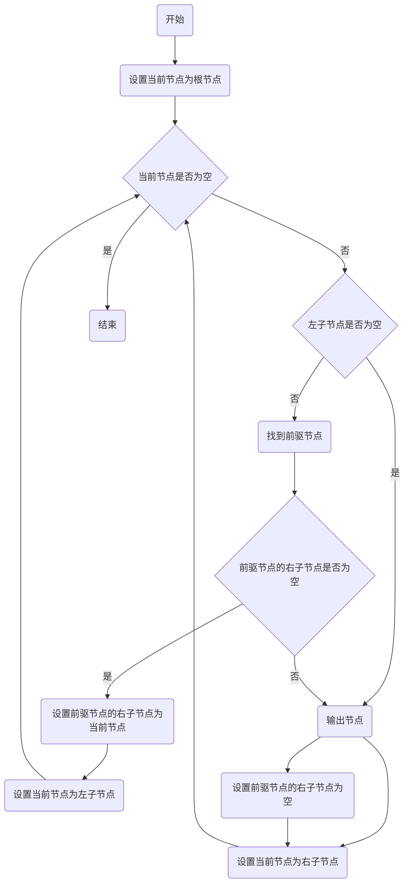

Morris 中序遍历的步骤如下：

1. 初始化当前节点为根节点。
2. 如果当前节点的左孩子为空，输出当前节点并更新当前节点为右孩子。
3. 如果当前节点的左孩子不为空，找到当前节点左子树的最右节点（这个节点也是当前节点的前驱节点）。
   * 如果前驱节点的右孩子为空，将它的右孩子设置为当前节点。当前节点更新为当前节点的左孩子。
   * 如果前驱节点的右孩子为当前节点，将它的右孩子重新设为空（恢复树的形状）。输出当前节点（在这里输出，这就是与先序遍历唯一一点不同）。当前节点更新为当前节点的右孩子。
4. 重复以上步骤，直到当前节点为空。

##### Morris 后序遍历

***Morris 后序遍历流程图***

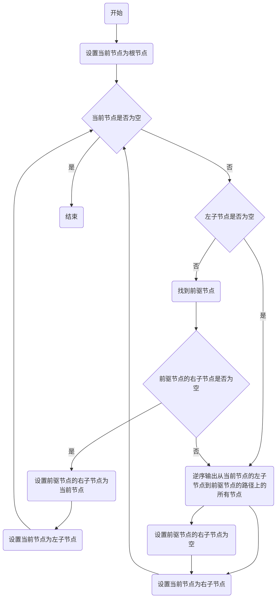

Morris 后序遍历的步骤如下：

1. 初始化当前节点为根节点。
2. 如果当前节点的左孩子为空，更新当前节点为右孩子。
3. 如果当前节点的左孩子不为空，找到当前节点左子树的最右节点（这个节点也是当前节点的前驱节点）。
   * 如果前驱节点的右孩子为空，将它的右孩子设置为当前节点。当前节点更新为当前节点的左孩子。
   * 如果前驱节点的右孩子为当前节点，将它的右孩子重新设为空（恢复树的形状）。然后反向输出从当前节点的左孩子到该前驱节点这条路径上的所有节点。当前节点更新为当前节点的右孩子。
4. 重复以上步骤，直到当前节点为空。
5. 最后，反向输出从根节点到最右节点的所有节点。

#### 2.2.4 三种遍历方法总结

二叉树递归遍历、非递归遍历和Morris遍历方法的对比：

1. **递归遍历**：递归遍历是最直观的遍历方法，它的思想是利用函数的递归（自我调用）特性，进行树的遍历。递归遍历的代码简洁易懂，但是递归深度过深会导致栈溢出。
2. **非递归遍历**：非递归遍历是为了解决递归遍历可能导致的栈溢出问题，它的思想是使用一个辅助的栈来模拟递归过程。非递归遍历的代码相比递归遍历更复杂一些，但是它能有效避免栈溢出的问题。
3. **Morris遍历**：Morris遍历是一种非常巧妙的遍历方法，它的思想是利用树的大量空闲指针，实现常数空间复杂度的遍历。Morris遍历的代码相比递归和非递归遍历更复杂，但是它的空间复杂度只有O(1)，是一种非常高效的遍历方法。

总的来说，递归遍历、非递归遍历和Morris遍历各有优缺点，适用于不同的场景。在实际使用中，可以根据具体需求选择合适的遍历方法。

### 2.3 二叉树的重建

#### 2.3.1 基于先序和中序重建后序

#### 2.3.2 基于中序和后序重建先序

#### 2.3.3 基于先序和后序重建中序

## 3. 排序二叉树(BST)

### 查找算法

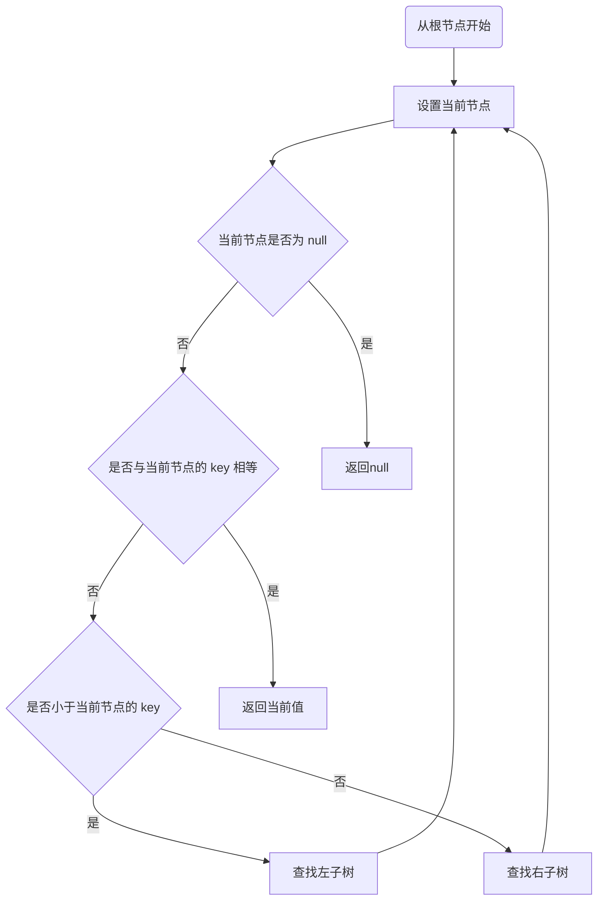

## 4. 二叉平衡树

## 5. AVL 树

## 6. 红黑树

红黑树是一种自平衡的广义的二叉平衡树。

红黑树的性质：

* 节点非黑即红
* 根节点为黑色
* 红色节点不相邻
* 从任何一个节点到其所有后代叶子节点所经历的路径上的黑色节点数量

### 红黑树查找算法

红黑树也是排序二叉树，其查找算法与其他排序二叉树无异。

### 红黑树插入算法

红黑树的插入包括两部分：

1. 确定插入位置并插入
2. 保持自平衡

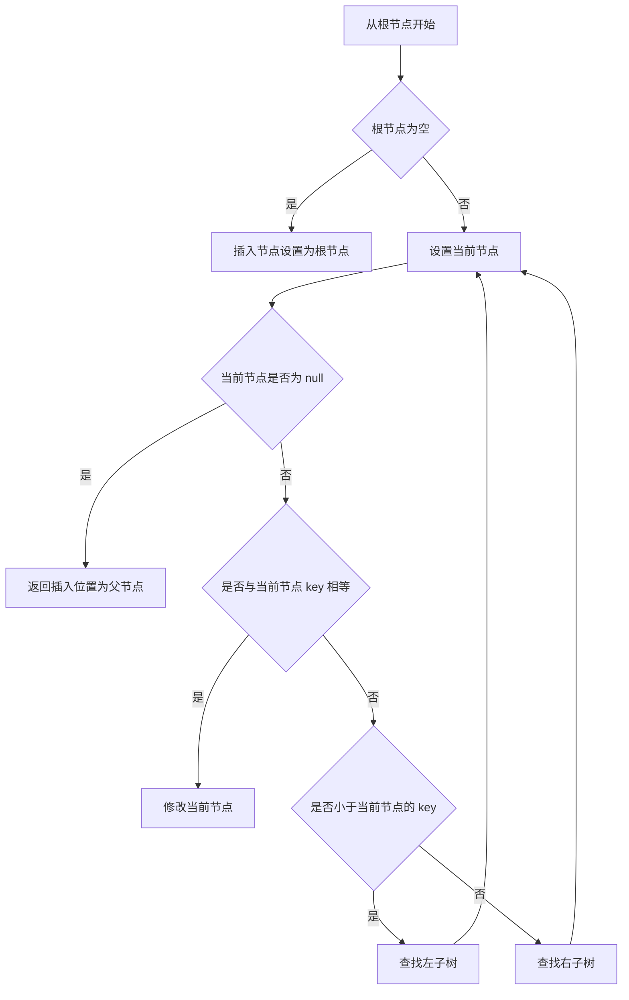

插入的场景

## 7. SB 树(Size Blanced Tree)

## 8. B-树 (Balanced Tree)

如果一棵树的所有节点都只有左子树或只有右子树，或者同一个节点的子树高度偏差很大，就称为该树不平衡。

B-树（Balanced Tree，也称平衡搜索树）是一种约束了形状的树。其中的平衡指树的高度，B-树的每个节点的子树的度都相同。

B-树是一种自平衡的树，能够在保持数据有序的同时，保证子树高度一致。B-树的这种特性，使得查找、删除和插入数据都能在 O(logN) 时间内完成。

### 8.1 B-树的性质

* 所有叶子节点都在同一个层次上；
* 任意一个节点的子树，度都相同；
* m 阶 B-树指的是度为 m 的 B-树，即节点的度的最大值为 m；
* m 阶 B-树的每个节点最多有 m 个节点；每个内部节点至少有 [m/2] 个子节点 （**[x]表示x向上取整;
* 如果根节点不是叶子节点，那它至少有两个子节点；
* m 阶 B-树的每个节点上最多可以有 m-1 个键。

### 8.2 B-树的相关术语

***B-树术语***

|术语|说明|
|----|----|
| 键 | 用于将数据排序的值，B-树的每个节点上可以有多个键|

### 8.3 2-3-4 树

特点：

1. 大致遵循二叉树的特点，即大于左子树上的节点，小于右子树上的节点
2. 节点包含多个元素时，元素的排列顺序是从小到大
3. 所有的叶子节点都位于最底层，且位于同一层
4. 所有的非叶子节点都必须已经连满子树

插入步骤：

## 9. B+树

## 10. B*树

## 11. 总结

