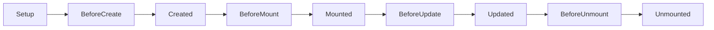

> VUE

<!-- more -->
* TOC
{:toc}

|术语|说明|
|----|----|
|SFC|Single File Component，单文件组件，将 HTML、CSS、JS 封装一个单一文件中|
|声明式渲染|通过扩展标准 HTML 的模板语法，使用 JS 描述 HTML |

### 1. 声明式渲染

响应式 API

* `ref()`，可以绑定任意值
* `reactive()`，只能绑定对象类型，包括自定义对象和内置对象，数组和set等

如：

```vue
<script setup>
import {ref, reactive} from 'vue'

const counter = reactive({
    count:0
})

const message = ref("Hello")
</script>

<template>
<h1>{{ message }}</h1>
<p>count is :{{ counter.count }}</p>
</templatet>
```

### 2. `Attribute` 绑定

使用 `v-bind:attributeName` 可以给元素动态绑定值，`v-bind` 还可以省略

```vue
<script setup>
import {ref} from 'vue'

const titleClass = ref('title')
</script>

<template>
<h1 :class="titleClass">Header</h1>
</template>

<style>
.title {
    color: red;
}
</style>
```

### 3. 事件监听

使用 `v-on` 指令来监听 DOM 事件，如使用 `v-on:click` 监听点击事件，可简写为 `@click`

```vue
<script setup>
import { ref } from 'vue'

const count = ref(0)

function add() {
  count.value ++
}
</script>

<template>
  <!-- 使此按钮生效 -->
  <button @click="add">count is: {{ count }}</button>
</template>
```

### 4. 表单绑定

可以同时使用 `v-bind` 和 `v-on` 在表单元素上创建双向绑定

如下输出框，会在输入内容时同步改变文本值：

```vue
<script setup>
import { ref } from 'vue'

const text = ref('')

function onInput(e) {
    text.value = e.target.value
}
</script>

<template>
<input :value='text' @input='onInput' place-holder="Type here"/>
<p>{{ text }}</p>
</template>
```

这种双向绑定太过于频繁，VUE 提供了 `v-model` 简化这种双向绑定，如 `<input v-model='text' place-holder="Type here"/>`

`v-model` 不仅支持文本框，还支持复选框、单选框、下拉框等元素。

### 5. 条件渲染

使用 `v-if` 和 `v-else` 来实现有条件的渲染

```vue
<script setup>
import { ref } from 'vue'

const awesome = ref(true)

function toggle() {
  awesome.value = !awesome.value
}
</script>

<template>
  <button @click="toggle">toggle</button>
  <h1 v-if="awesome">Vue is awesome!</h1>
  <h1 v-else>Oh no 😢</h1>
</template>
```

### 6. 列表渲染

使用 `v-for` 来渲染基于数组的列表

```vue
<script setup>
const newTodo = ref('')
const todos = ref([
  { id: id++, text: 'Learn HTML' },
  { id: id++, text: 'Learn JavaScript' },
  { id: id++, text: 'Learn Vue' }
])

function addTodo() {
  todos.value.push({ id: id++, text: newTodo.value })
  newTodo.value = ''
}

function removeTodo(todo) {
  todos.value = todos.value.filter((t) => t !== todo)
}
</script>

<template>
  <form @submit.prevent="addTodo">
    <input v-model="newTodo">
    <button>Add Todo</button>    
  </form>
  <ul>
    <li v-for="todo in todos" :key="todo.id">
      {{ todo.text }}
      <button @click="removeTodo(todo)">X</button>
    </li>
  </ul>
</template>
```

### 7. 计算属性

使用 `computed` API 动态绑定一个变量的处理过程

### 8. 生命周期和模板引用

生命周期：



`Setup` 阶段，DOM 尚未渲染，我们可以使用 `ref attribute` 实现模板引用，在 `Mounted` 后修改前期引用的 DOM。

### 9. 侦听器

有时我们需要响应式的执行一些任务，比如当一个数字改变时在控制台输出，就可以使用侦听器，通过 `watch` 实现

### 10. 组件

父组件可以在模板中嵌套另一个组件作为子组件，要使用子组件，我们需要先导入，如 `import ChildComp from './ChildComp.vue'`，然后就可以使用 `<ChildComp />` 引用子组件

### 11. Props 传值

父组件可以通过 `Props` 向子组件传递值

首先需要在子组件中通过 `defineProps()` 声明

### 12. Emits 触发事件

子组件可以通过 `Emits` 触发父组件中的事件

首先需要通过 `defineEmits()` 在子组件中定义，父组件通过 `v-on` 来监听子组件传递的事件

```vue
<script setup>
import { ref } from 'vue'
import ChildComp from './ChildComp.vue'

const childMsg = ref('No child msg yet')
</script>

<template>
  <ChildComp @response="(msg) => childMsg = msg"/>
  <p>{{ childMsg }}</p>
</template>
```

### 13. 插槽 Slot

父组件还可以通过插槽将模板片段传递给子组件，如父组件中，

```vue
<ChildCompn>
    some slots
</ChildComp>
```

在子组件中这样使用，

```vue
<slot/>
···
