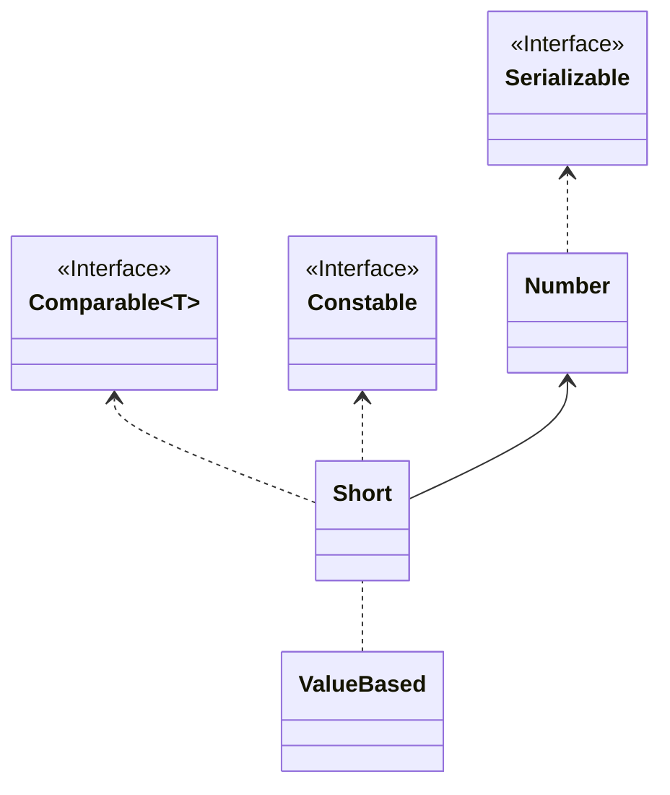
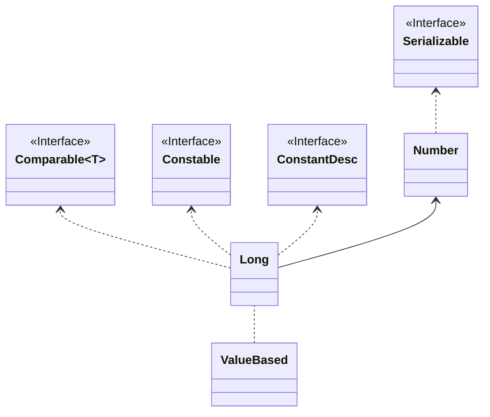
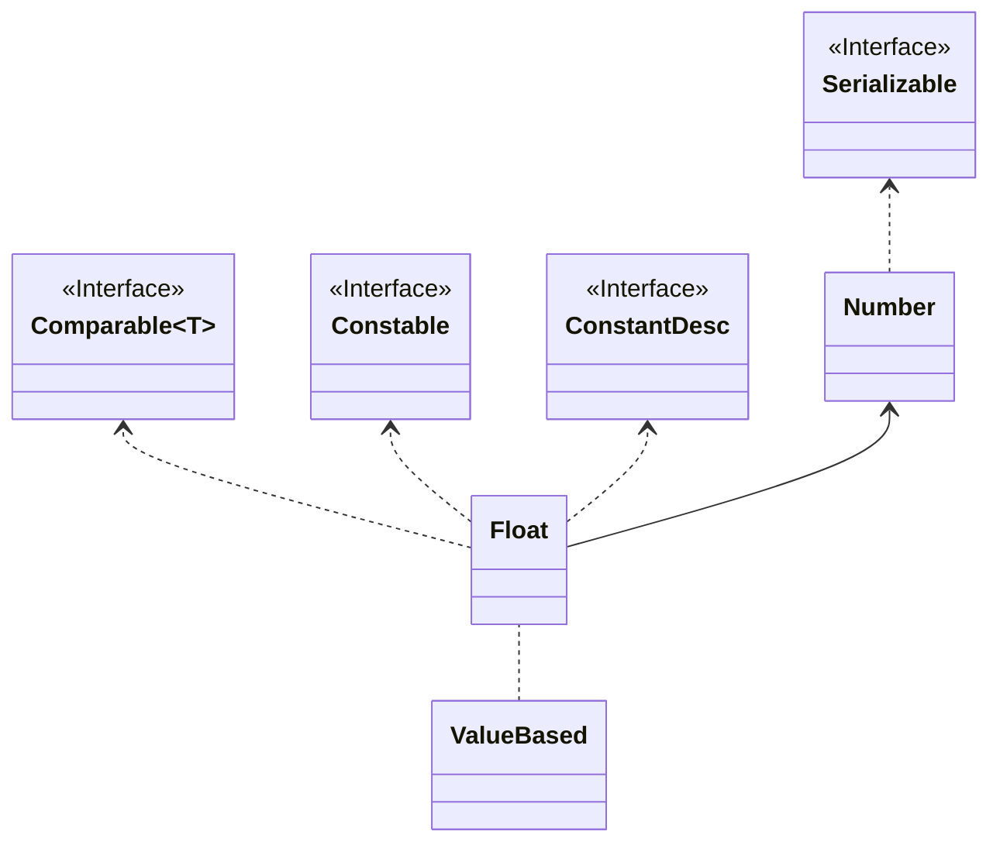
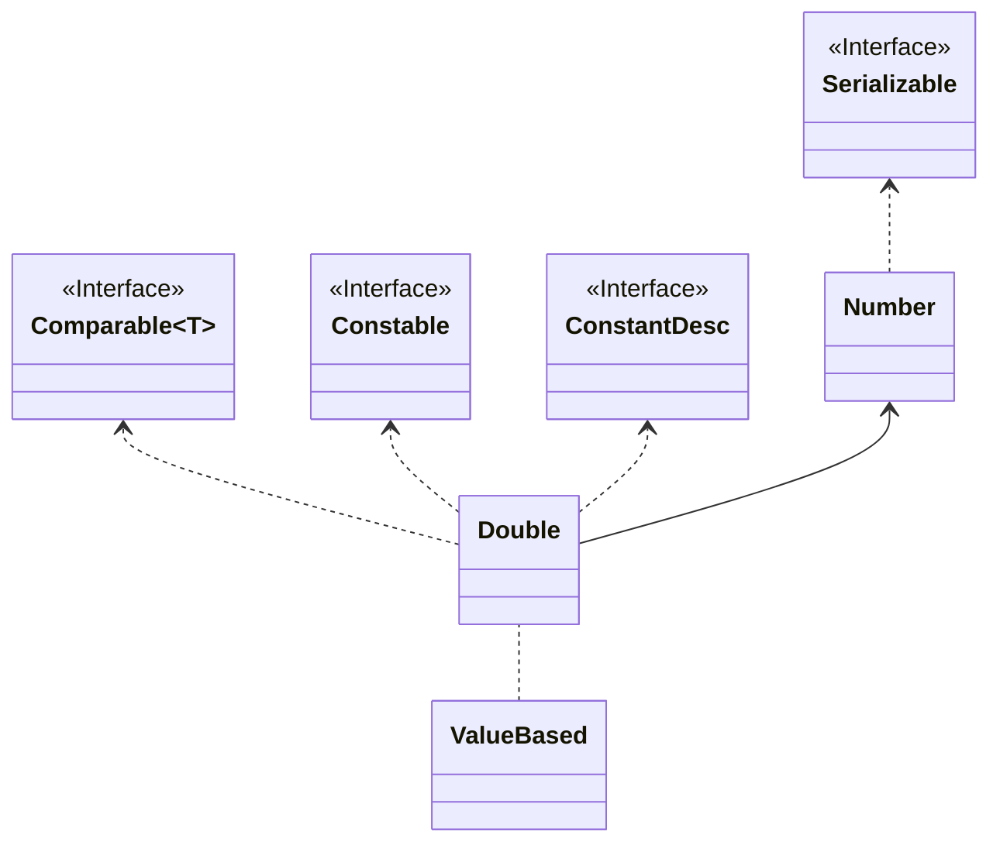
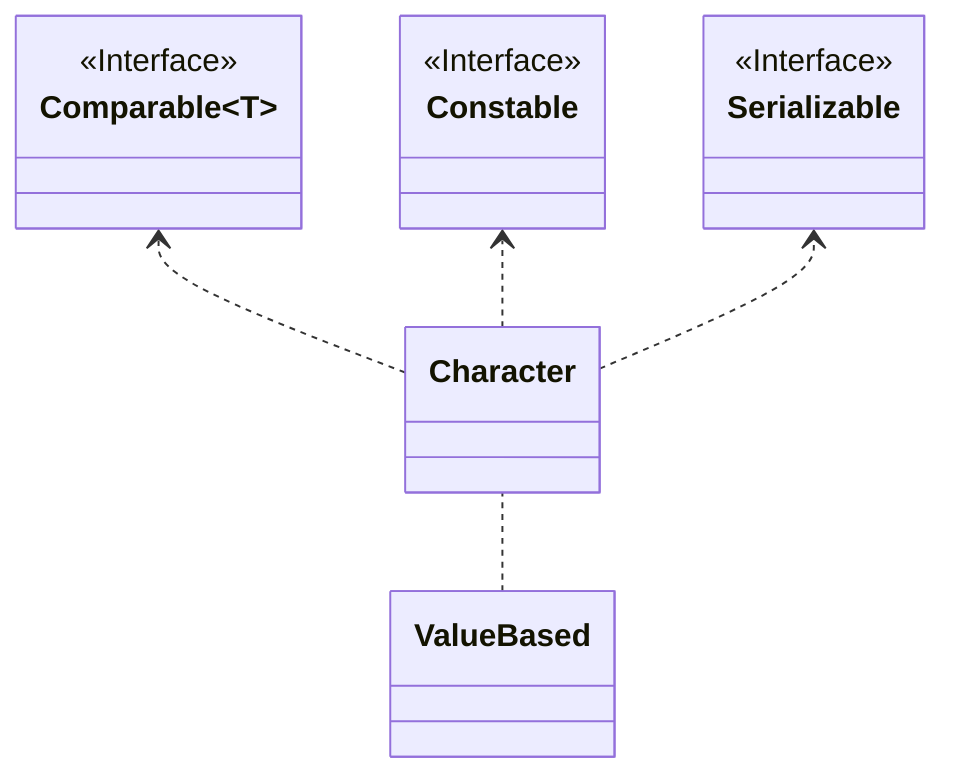
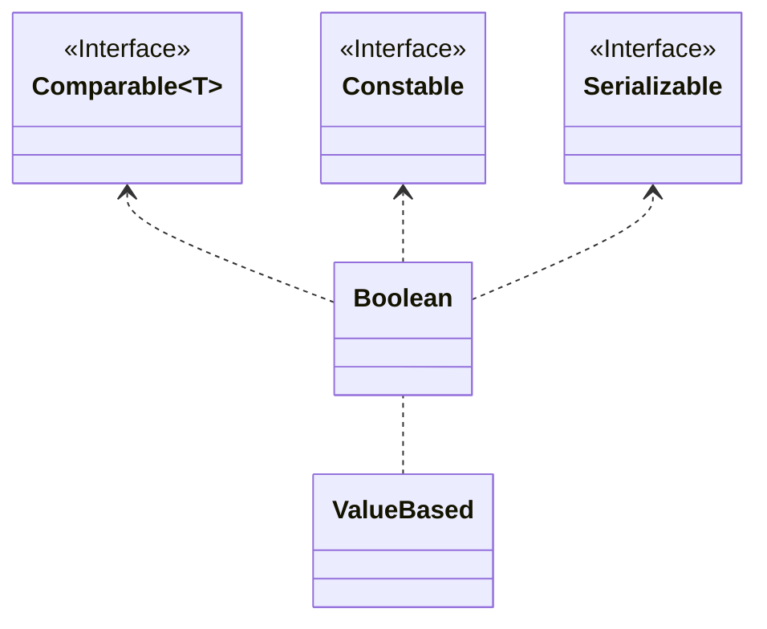

> 本文梳理了 Java 中的 8 种基本数据类型、各种类型的二进制表示，以及对应包装类型的实现细节，总结了这些基本类型在 Java 中的理解和使用范式。

<!-- more -->
* TOC
{:toc}

## 1. Java 的 8 种基本数据类型

Java 语言提供了 8 种基本数据类型，其中包括 4 种整数型（byte、short、int 和 long）、2 种浮点型（float 和 double)、1 种字符型（char）和一种布尔型（boolean）。

### 1.1 整数型数据类型

4 种整数类型，除了因为所占字节数不同而导致的可表示的数据范围不同外，其他方面都一样。

Java 中只支持有符号整数，符号位都是通过二进制的最高位表示，0 表示正数，1 表示负数。

|整数类型|占字节数|表示范围|最大值二进制|
|-------|--------|--------|----------|
|byte|1|-2^7,2^7-1|`0111 1111`|
|short|2|-2^15,2^15-1|`0111 1111 1111 1111`|
|int|4|-2^31,2^31-1|`0111 1111 1111 1111 1111 1111 1111 1111`|
|long|8|-2^63,2^63-1|`0111 1111 1111 1111 1111 1111 1111 1111 1111 1111 1111 1111 1111 1111 1111 1111`|

如上：

* 对于一个占 k 个字节的整数类型，其二进制位数一共是 8k 位（记作 n，即 `n = 8k`）
* 最大值为 `2^(n-1) - 1`，最小值为 `-2^(n-1)`

**注**：整数二进制使用补码表示，补码表示正数时直接使用，表示负数时先抛开最高位符号位，剩余部分取反后加 1 然后符号位置为 1（负数补码求原值也是一样的操作，取反后加 1）。

### 1.2 浮点型数据类型

Java 中 2 种浮点型数据类型，采用的是 IEEE 754 标准，相互之间也是除了因为所占字节数不同而导致的可表示的数据范围不同外，其他方面都一样。

|浮点型类型|占字节数|二进制表示 1.5|
|---------|--------|--------|
|float|4|`0011 1111 1100 0000 0000 0000 0000 0000`|
|double|8|`0011 1111 1111 1000 0000 0000 0000 0000 0000 0000 0000 0000 0000 0000 0000 0000`|

如上，

* 对于一个占 k 个字节的浮点数类型，其二进制位数一共是 8k 位
* 其中 `float` 类型占 32 位，由 1 位符号位 + 8 位精度位组成 + 23 位有效数位
* 其中 `double` 类型占 64 位，由 1 为符号位 + 11 位精度位组成 + 52 位有效数位

根据 IEEE 754 标准规定，任意一个浮点数可以表示为 `(-1)^s * M * 2^E`，其中

* s 为符号位的值
* M 表示有效位尾数部分，标准规定一个非特殊、有效的浮点数整数部分总是为 1，因为对于 `float` 类型就是用 23 位表示尾数部分
* E 表示指数，关于 E 也有规定
  * E 全部为 1 时，表示 M 部分的位只能全部为 0，这时 s 为 1 表示负无穷，s 为 0 表示正无穷
  * E 全部为 0 时，表示 M 部分的位就是实际值，即不再默认整数部分为 1（此时是 0），此时 E 的值为 1 - 127（或者 1 - 1023)，整体表示一个无限接近于 0 的数
  * E 不全为 0 或 1 时，首先计算 E 的值，float 范围为 [1, 2^8 - 1]，得到的值减去中间值 127（double 减去 1023)

```java
// java 打印浮点数类型的二进制形式

System.out.println(Integer.toBinaryString(Float.floatToIntBits(1.5F)));
System.out.println(Long.toBinaryString(Double.doubleToLongBits(1.5D)));
```

### 1.3 字符型数据类型

字符型数据类型 char 占用的字节数可变，ASCII 字符占用一个字节，中文字符占 3 个字节。

字符型数据占用字节数与使用的编码相关，Java 默认使用 `UTF-8` 编码。

程序中经常出现的乱码问题，通常就是编码不一致导致的。

### 1.4 布尔型数据类型

布尔类型的数据只有两个值：true 和 false，理论上只需要一个位即可，但实际内存分配以字节为最小单位，因此布尔类型固定占用 1 个字节。

## 2. 8 种基本数据类型对应的包装类型

作为面向对象的语言，Java 为 8 种基本数据类型都提供了对应的类类型，并支持类类型与基本类型之间自动拆装箱。

|基本类型|包装类型|
|--------|--------|
|`byte`|`Byte`|
|`short`|`Short`|
|`int`|`Integer`|
|`long`|`Long`|
|`float`|`Float`|
|`double`|`Double`|
|`char`|`Character`|
|`boolean`|`Boolean`|

* 以上包装类型中数值类型（包括整数和浮点数），都定义了 `MAX_VALUE` 和 `MIN_VALUE`
* `Character` 也定义了 `MAX_VALUE` 和 `MIN_VALUE`，用于表示编码范围
* 8 种包装类型都实现了 `Serializable` 接口、`Comparable<T>` 接口以及 `Constable` 接口，并且被 `ValueBased` 注解
  * `Serializable` 接口用于支持序列化和反序列化，本身没有定义任何方法
  * `Comparable<T>` 接口定义了一个和同类对象比较的方法，用于支持排序
  * `Constable` 接口是在 jdk 12版本加入的，用于表示一个类型可以在常量池中自描述（TODO::暂时不清楚实际编码中用法）
* 除了 `Boolean` 和 `Character` 外的其他 6 种包装类都继承了 `Number` 抽象类，使得这 6 种包装类型具备了相互转换的能力
  * `Number` 抽象类定义了 6 个抽象方法，用于获取对应 6 种基本类型值
    * `int intValue()`，对于 Integer 返回其本身值，对于其他 5 种类型，转换为 int 类型值
    * `long longValue()`，类上描述
    * `byte byteValue()`，类上描述
    * `short shortValue()`，类上描述
    * `float floatValue()`，类上描述
    * `double doubleValue()`，类上描述
* 8 种包装类型都重写了默认的 `equals(o)` 方法，比较的是实际值

### 2.1 Byte

`Byte` 类内部持有一个 `final byte value` 实例，用于拆装箱时对应，以及和其他各种数值类型转换。


`Byte` 类有以下特点：

1. 自 `JDK 9` 开始，已经不推荐使用构造方法创建 `Byte` 实例，建议直接使用基本类型，或者通过 `valueOf(b)` 构造
2. 可以基于 `String` 构造 `Byte` 实例，构造时指定进制，默认以 10 进制构造
3. `Byte` 类对所能表示范围 [-128, 127] 内的所有实例都进行了缓存

### 2.2 Short



1. `Short` 类对 `byte` 取值范围（[-128, 127]）内的实例进行了缓存
2. 同样废弃了使用构造方法创建实例的方式，不推荐使用
3. 提供了 `reverseBytes(s)` 的类方法，用于处理字节序不一致时的数值转换

### 2.3 Integer

`Integer` 类相对于其他几种包装类，应该是使用最为频繁的了。

除了一些共性实现（各种值类型之间转换、重写 equals、缓存 byte 范围内实例等），还额外提供一些方法，包括：

* `toXXXString(i)` 输出二进制、八进制、十六进制、自定义进制形式的字符串（其他类型可以先转为 int 类型再输出）
* `highestOneBit(i)` 和 `lowestOneBit(i)` 获取最高位和最低位字节的值
* `numberOfLeadingZeros(i)` 获取二进制形式前面连续 0 的个数
* `int numberOfTrailingZeros(i)` 获取二进制形式后面连续 0 的个数
* `int bitCount(i)` 获取二进制形式中 1 的个数
* `int reverse(i)` 获取按位反向后的值 —— （采用了一个经典的算法，一一交换=>二二交换=>四四交换，先完成字节逆序，再将字节逆序）
* `rotateLeft(i, d)` 和 `rotateRight(i, d)` 向左或者向右旋转指定位数 —— （ `>>>` 一个负数，相当于右移 32 加这个负数位，`>>> -18` 等价于 `>>> 14`）
* `Integer` 类的缓存范围可以通过环境变量 `java.lang.Integer.IntegerCache.high` 调整上限


### 2.4 Long

`Long` 类大致与 `Integer` 类一致，拥有 `Integer` 额外适配的字符串输出格式以及各种字节相关操作。

`Long` 类型也不推荐使用构造方法来创建实例。

但是**`Long` 类型的缓存是没法通过环境变量配置的**。



### 2.5 Float

`Float` 类型是没有缓存的，但也不推荐通过构造方法创建实例（`valueOf()` 方式创建实例还是直接调用了构造方法，这里可能是为了包装类类型使用上的一致性）。

此外，`Float` 类提供了以下的方法：

* `int floatToIntBits(value)`，将 float 值的字节作为 int 值的字节看待（bit 位不会有变化，和 `intValue()` 是不一样的含义）
* 提供了正无穷、负无穷、NaN 特殊常量值定义（NaN 无论和谁比较都是不能，其自身也不例外）



### 2.6 Double

`Double` 类也大致和 `Float` 类一样。

* 对应于 `int floatToIntBits(value)`，`Double` 类提供了 `long doubleToLongBits(value)` 将 double 值的字节作为 long 值的字节看待，可以用于查看 double 值的实际二进制位字符串。
* 另外 `Double.NEGATIVE_INFINITY`、`Double.POSITIVE_INFINITY` 与 `Float.NEGATIVE_INFINITY` 和 `Float.POSITIVE_INFINITY` 是对应相等的



### 2.7 Character

字符类 `Character` 没有继承 `Number` 类，不能直接与各类数值直接互转，但提供了很多字符操作函数。

* 缓存了 [0, 128] 范围内的 `Character` 实例，可以涵盖 ASCII 码
* 重写了 `hashCode()` 方法，返回 char 对应的 int 值
* `boolean isValidCodePoint(int codePoint)`，返回是否是一个有效 unicode 编码值（取值范围[0x000000,  0X10FFFF]
* `isLowerCase()` 方法，返回字符是否是小写，[a, z] 和 ['\u00DF', '\u00FF'] 范围内满足
* `isUpperCase()` 方法，返回字符是否是小写，[A, Z] 和 ['\u00C0', '\u00DE'] 范围内满足
* `isTitleCase()` 方法，返回字符是否标题大小写形式，[参见](https://w3schools.cn/javalang/character_istitlecase.asp)
* `isDigit()` 方法，返回字符是否为数字
* `isLetter()` 方法，返回字符是否是字母
* `isLetterOrDigit()` 方法，返回字符是否为数字或者字母
* `isSpaceChar()` 方法，返回字符是否为空字符，包括字符分隔符、行分隔符、页分隔符
* `isWhitespace()` 方法，返回字符是否为空字符，包括制表符、换行符、文件结束符、分隔符等



### 2.8 Boolean

`Boolean` 类就相对简单的多了，除了常规的从字符串转布尔值、重写 `hashCode()` 等方法，以及基于 `valueOf()` 构造实例外，主要提供了 3 个逻辑操作：

* `boolean logicalAnd(a, b)`，逻辑与，同时为 true 返回 true
* `boolean logicalOr(a, b)`，逻辑或，同时为 false 返回 false
* `boolean logicalXor(a, b)`，逻辑异或，二者值不同时返回 true



## 3. Java 提供的关于 8 中基本数据类型（含包装类型）的操作

JDK 除了提供了 8 种基本数据类型相互转换的能力，还提供了一些便利的集合操作。

### 3.1 Arrays 工具类

* `void sort(k[] arr)`系列重载的 `sort` 方法提供了对 7 中基本数据类型（不含 `boolean`）数组的排序功能
* `void parallelSort(k[] arr)` 系列重载方法支持并行排序，但 `byte`、`short` 和 `char` 本身取值范围不大，JDK 的并行排序实现实际还是串行的，而对于 `int`、`long`、`float` 和 `double` 则实现并行
* `int binarySearch(k[] arr)` 系列重载方法提供了二分查找功能
* `equals(k[] arr1, k[] arr2)` 系列重载方法提供了比较两个数组的功能
* `fill(k[] arr, k v)` 系列重载方法提供了填充一个指定数组的功能
* `copyOf(k[] otigin, int len)` 系列方法则提供了从指定数组中拷贝指定长度数据的功能
* `copyOfRange(k[] otigin, int from, int to)` 系列方法则提供了从指定数组中拷贝指定范围数据的功能
* `hashCode(k[] arr)` 则提供了求一个数组的 hash 值的功能
* `toString(k[] arr)` 则支持将数组以字符串形式拼接
* `setAll(k[] arr, IntFunction<? extends T> generator)` 提供了以指定生成器方式填充一个数组的方法
* `spliterator(k[] arr)` 系列重载方法返回可拆分迭代器
* `stream(k[] arr)` 系列重载方法提供了数组转流的功能
* `compare(k[] arr1, k[] arr2)` 系列重载方法提供了两个数组对比的功能
* `mismatch(k[] arr1, k[] arr2)` 系列重载方法提供了返回两个数组首个不等元素位置的功能

## 4. 总结

8 中基本数据类型及其包装类型，是构成其他一切应用的基础。综合上文的介绍，我们很容易感受到 8 种类型无论是设计实现，还是使用上都体现了一种统一性，这正是 Jdk 的优雅之处。总结起来大致如下：

* 表示范围可由基本类型占用的字节数来推断
* 继承了 `Number` 抽象类的包装类提供了统一转换为其他类型的接口
* 对 `byte` 值范围的包装类实例提供了缓存，可以节省空间（正确使用的条件下）
* 通过 `Arrays` 工具类对基本类型数组的拷贝、排序、打印输出、比较以及查找等提供了统一的支持
