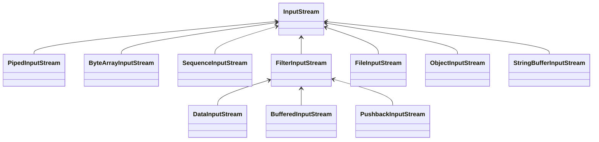
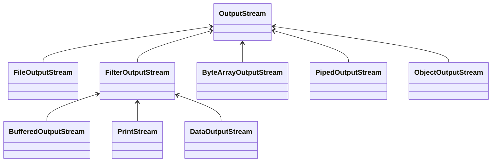
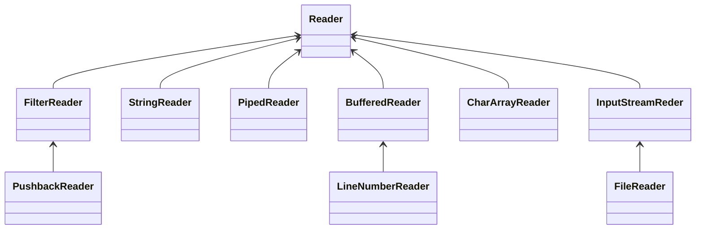
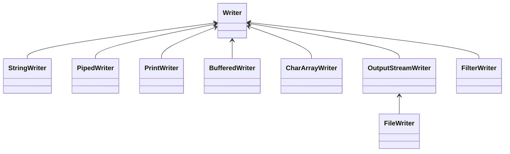
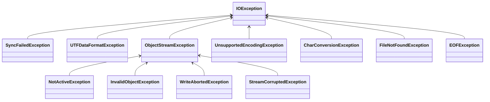

> Java IO 包中定义了字节流和字符流操作类，以及文件操作类，为数据传输处理、持久化、序列化和反序列化提供了基础支持。

<!-- more -->
* TOC
{:toc}

### 概述

1. 流的概念：流是一组有顺序的、有起始和终止的字节集合，是对数据传输的抽象
2. 流的分类：
   1. 根据处理数据类型的不同分为：字符流和字节流
   2. 根据处理数据流向不同分为：输入流和输出流
   3. 根据流的用处不同分为：节点流和处理流
3. 字符流和字节流：因为数据编码的不同，而有了对字符进行高效操作的流对象，本质上就是基于字节流读取时查询对应码表，二者区别在于
   1. 读写单位不同：字节流以字节为单位，字符流以字符为单位
   2. 处理对象不同：字节流可以处理所有类型的数据，而字符流只能处理字符类型的数据
4. 输入流和输出流：输入流只能进行读操作，输出流只能进行写操作
5. 节点流和处理流：节点流直接与数据源相连进行读写，处理流需要配合节点流使用
   1. 常用的节点流
      1. 父类：`InputStream`、`OutputStream`、`Reader`、`Writer`
      2. 文件：`FileInputStream`、`FileOutputStream`、`FileReader`、`FileWriter`
      3. 数组：`ByteArrayInputStream`、`ByteArrayOutputStream`、`CharArrayReader`、`CharArrayWriter`
      4. 字符串：`StringReader`、`StringWriter`
      5. 管道：`PipedInputStream`、`PipedOutputStream`、`PipedReader`、`PipedWriter`
   2. 常用的处理流（处理流都提供了基于节点流的构造函数）
      1. 缓冲流：`BufferedInputStream`、`BufferedOutputStream`、`BufferedReader`、`BufferedWriter`
      2. 转换流：`InputStreamReader`、`OutputStreamWriter`
      3. 数据流：`DataInputStream`、`DataOutputStream`、`ObjectInputStram`、`ObjectOutputStream`

Java IO 包（`java.io`）中有两对接口，是 IO 系列类的鼻祖：

1. `InputStream` 和 `OutputStream`，是字节流的基类
2. `Reader` 和 `Writer`，是字符流的基类

### `Inputstream`

`Inputstream` 是所有字节输入流的父类，这是一个抽象类。`Inputstream` 主要定义了如下方法：

* `int read()`，从流中读取下一个字节，虽然返回类型为 `int`，但实际值范围为 `[0, 255]`，如果读到了流结尾，则返回 `-1`
* `int read(byte[] bytes)`，一次读取多个字节，第一个放入 `bytes[0]`，第二个放入 `bytes[1]`，以此类推，一次最多读入传入的字节数组长度的字节，但实际读入字节数可能少于数组长度，返回值为实际读入的字节数（`InputStream` 中该方法的实现时调用上一个一次读一个字节的方法
* `int read(byte[] bytes, int off, int len)`，另一个批量读取的方法，读入的第一个字节放入 `bytes[off]`，最多读取 `len` 长度的字节
* `void cloas()`，流读取结束后应该关闭，以释放资源
* `long skip(long n)`，跳过流中的 n 个字节，返回实际跳过的字节数
* `int available()`，返回下一次不需要阻塞就能读到的字节数
* `void mark(int readlimit)` 和 `void reset()`，先标记一个位置，然后在读取了一部分字节后，跳回来重新读
* `boolean markSupported()` 判断当前流是否支持标记重读
* `long transferTo(OutputStream out)` 将读取的字节流按顺序写入输出字节流



### `OutputStream`

`OutputStream` 是所有字节输出流的父类，这是一个抽象类。`OutputStream` 主要定义了如下方法：

* `void write(int b)`，向流中写入一个字节，参数类型虽然是 int，但实际只会用到低 8 位
* `void write(byte[] bytes)`，批量写入字节数组
* `void write(byte[] bytes, int off, int len)`，从 `bytes[off]` 开始写入 `len` 个字节
* `void flush()`，将缓冲而未实际写入的数据进行实际写入
* `void close()`，释放流资源



### `Reader`

`Reader` 是所有字符输入流的父类，`Reader` 主要提供了以下方法：

* `int read()` 读一个字符，如果没有可读字符，该方法将阻塞，如果读到流尾则返回 -1
* `int read(char[] cbuf)` 向字符数组中读数据，返回实际读取的字符个数
* `int read(char[] cbuf, int off, int len)` 从字符流中读取 `len` 个字符放入 `cbuf` 数组，第一个字符放在 `cbuf[off]` 位置
* `long skip(long n)` 跳过 n 个字符，返回实际跳过的字符数
* `void mark(int readlimit)` 和 `void reset()`，先标记一个位置，然后在读取了一部分字节后，跳回来重新读
* `boolean markSupported()` 判断当前流是否支持标记重读
* `void close()` 关闭字符流
* `long transferTo(Writer out)` 将读取的字符按顺序写入输出字符流，返回字符数



### `Writer`

`Writer` 是所有字符输出流的父类，`Writer` 的主要方法有：

* `void write(int c)` 写入一个字符，int 值的高 16 位被忽略，低 16 位作为字符写入
* `void write(char[] cbuf)` 写入字符数组
* `void write(char[] cbuf, int off, int len)` 将字符数组从 `off` 位开始写入 `len` 个字符
* `void write(String str)` 写入一个字符串
* `void write(String str, int off, int len)` 将一个字符串从 `off` 位开始写入 `len` 个字符
* `Writer append(CharSequence csq)` 向字符流追加字符序列
* `Writer append(CharSequence csq, int start, int end)` 将字符序列的 `start` 至 `end` 部分写入字符流
* `Writer append(char c)` 向字符流追加一个字符
* `void flush()` 清空缓冲
* `void close()` 关闭流



### `Exception`



### `File`

`File` 类为所有文件相关的操作提供了便利，我们从构造方法、文件操作、文件属性来理解

#### 构造方法

4 个构造方法，用于创建文件实例

* `public File(String pathname)` 使用文件绝对路径
* `public File(URI uri)` 使用文件 `uri` 地址
* `public File(String parentPath, String child)` 指定父文件绝对路径，子文件相对路径
* `public File(File parent, String child)` 指定父文件，子文件相对路径

#### 创建

* `boolean mkdir()` 创建指定目录，如果父目录不存在则创建失败，返回 `false`，创建成功返回 `true`
* `boolean mkdirs()` 创建指定目录，如果父目录不存在则自动创建父目录，创建成功返回 `true`
* `boolean createNewFile()` 创建指定文件，文件不存在且成功创建则返回 `true`

#### 删除

* `boolean delete()` 删除指定文件或目录，删除成功则返回 `true`

#### 修改

* `boolean renameTo(File dest)` 重命名
* `boolean setLastModified(long time)` 重置最后访问时间
* `boolean setReadOnly()` 设置只读
* `boolean setWritable(boolean writable)` 修改可写
* `boolean setReadable(boolean readable)` 修改可读
* `boolean setExecutable(boolean executable)` 修改可执行

#### 查看

* `String[] list()` 查看当前目录下的文件或目录的列表，返回字符串数组
* `File[] listFiles()` 查看当前目录下的文件或目录列表
* `String getName()` 获取文件的名字（只有名字，没有路径）
* `String getParent()` 获取父目录绝对路径
* `File getParent()` 获取父文件，返回值是一个 `File` 对象
* `long lastModified()` 返回文件最后一次修改的时间戳
* `long length()` 返回文件的字节大小

#### 判断

* `boolean exists()` 文件或目录是否存在
* `boolean isFile()` 是否是文件
* `boolean isDirectory()` 是否是目录
* `boolean isHidden()` 是否是隐藏文件或目录
* `boolean isAbsolute()` 是否为绝对路径
* `boolean canRead()` 是否可读
* `boolean canWrite()` 是否可写
* `boolean canExecute()` 是否可执行

#### 类方法

* `static File[] listRoots()` 列出当前文件系统的根路径

### 总结

IO 中提供了一些便利的实现类：

* `FileInputStream` 和 `FileOutputStream` 是输入源和输出源分别是文件的字节流，是基于字节处理文件中的内容

```java
    @Test
    public void testFileOutputStream() {
        try (OutputStream output = new FileOutputStream("hello.txt")) {
            String data = "中国";
            output.write(data.getBytes(StandardCharsets.UTF_8));
        } catch (IOException exception) {
            System.out.println(exception.getMessage());
        }
    }

    @Test
    public void testFileInputStream() {
        try (InputStream input = new FileInputStream("hello.txt")) {
            int available = input.available();

            byte[] bytes = new byte[available];
            int read = input.read(bytes);

            System.out.println(new String(bytes, StandardCharsets.UTF_8));
        } catch (IOException exception) {
            System.out.println(exception.getMessage());
        }
    }
```

* `ByteArrayInputStream` 和 `ByteArrayOutputStream` 的输入源和输出源分别是字节数组，
  * `ByteArrayOutputStream` 有两个构造方法 `public ByteArrayOutputStream()` 和 `public ByteArrayOutputStream(int size)`，其中第二个构造方法指的是字节数组的初始大小，如果未指定则默认大小为 32，如果 write 过程中字节数组不够用，会进行指数扩展（每次至少增加一倍）
  * `ByteArrayOutputStream` 还额外增加了 `byte[] toByteArray()` 方法，用于输出一个字节数组

```java
    @Test
    public void testByteArrayInputStream() {
        byte[] bytes = {(byte) 0xe4, (byte) 0xb8, (byte) 0xad, (byte) 0xe5, (byte) 0x9b, (byte) 0xbd, (byte) 0xe4, (byte) 0xba, (byte) 0xba};
        try (InputStream input = new ByteArrayInputStream(bytes)) {
            int available = input.available();

            byte[] reads = new byte[available];
            int read = input.read(reads);

            System.out.println(new String(reads, StandardCharsets.UTF_8));
        } catch (IOException exception) {
            System.out.println(exception.getMessage());
        }
    }

    @Test
    public void testByteArrayOutputStream() {
        try (ByteArrayOutputStream output = new ByteArrayOutputStream()) {
            String data = "中国";
            output.write(data.getBytes(StandardCharsets.UTF_8));

            System.out.println(Arrays.toString(output.toByteArray()));
        } catch (IOException exception) {
            System.out.println(exception.getMessage());
        }
    }
```

* `DataInputStream` 和 `DataOutputStream` 是装饰类 `FilterInoutStream` 和 `FilterOutputStream` 的子类，输入源和输出源范围进一步扩大，可以是 int、double 等

```java
    @Test
    public void testDataOutputStream() {
        try (DataOutputStream output = new DataOutputStream(new BufferedOutputStream(new FileOutputStream("test.txt")))) {
            output.writeInt(100);
            output.writeUTF("这里是中国");
            output.writeFloat(960.64f);

            output.flush();
        } catch (IOException exception) {
            System.out.println(exception.getMessage());
        }
    }

    @Test
    public void testDataInputStream() {
        try (DataInputStream input = new DataInputStream(new BufferedInputStream(new FileInputStream("test.txt")))) {
            int i = input.readInt();
            String s = input.readUTF();
            float f = input.readFloat();
            
            System.out.println("i = " + i + ", s = " + s + ", f = " + f);
        } catch (IOException exception) {
            System.out.println(exception.getMessage());
        }
    }
```

* `BufferedInputStream` 和 `BufferedOutputStream` 也是装饰类，主要配合 `FileInputStream` 和 `FileOutputStream` 使用，用于提供缓冲减少磁盘 IO
* `InputStreamReader` 和 `OutputStreamWriter` 用于将字节流转换为字符流，字符流中一个重要的参数是编码类型，不同的编码决定了同一个字符实际使用字节形式
* `FileReader` 和 `FileWriter` 是 `InputStreamReader` 和 `OutputStreamReader` 的子类，可以直接对自负序列进行进行操作，按照指定编码读或者写文本文件（jdk 11 之前不支持指定编码）

```java

    @Test
    public void testWriter() {
        try (Writer writer = new FileWriter("hello.txt", StandardCharsets.UTF_8)) {
            writer.write("赢在中国");
        } catch (IOException exception) {
            System.out.println(exception.getMessage());
        }
    }
    
    @Test
    public void testReader() {
        try (Reader reader = new FileReader("hello.txt", StandardCharsets.UTF_8)) {
            char[] chs = new char[1024];
            int read = reader.read(chs);

            for (int i = 0; i < read; i++) {
                System.out.print(chs[i]);
            }

        } catch (IOException exception) {
            System.out.println(exception.getMessage());
        }
    }
```

* `CharArrayReader` 和 `CharArrayWriter` 的输入和输出目标是字符数组，这个数组的长度可以动态扩展
* `StringReader` 和 `StringWriter` 的输入和输出目标是字符串，和 `CharArrayReader` 和 `CharArrayWriter` 本质上一样
* `BufferedReader` 和 `BufferdWriter` 是装饰类，主要提供缓冲作用，**提供了 `String readLine()` 和 `void writeLine()` 可以按行读写**，通常配合 `FileReader` 和 `FileWriter` 使用
* `PrintStream` 和 `PrintWriter` 分别继承自 `OutputStream` 和 `Writer`，即分别对应字节和字符的处理，二者有很多相似之处，都提供系列 `print` 和 `prinln` 重载方法，以及格式化输出方法，都是把各种类型调用 `String.valueOf` 后再对字符串输出，二者行为基本一样

```java
    @Test
    public void testStream() {
        try (PrintStream printStream = new PrintStream("stream.dat", StandardCharsets.UTF_8)) {
            printStream.println(123);
        } catch (IOException exception) {
            System.out.println(exception.getMessage());
        }
    }

    @Test
    public void testWriter() {
        try (PrintWriter printWriter = new PrintWriter("writer.txt", StandardCharsets.UTF_8)) {
            printWriter.println(123);
        } catch (IOException exception) {
            System.out.println(exception.getMessage());
        }
    }
```

* `Scanner` 是一个单独的类，他是一个简单地文本扫描器，能够分析基本类型和字符串，他需要一个分隔符来讲不同的数据区分开来，默认使用的是空白符，可以通过 `useDelimiter()` 进行指定，`Scanner` 有很多 `nextXXX()` 方法用于读取下一个数据

### 参考

* 马俊昌.《Java 编程的逻辑》
* [https://www.cnblogs.com/zhaoyanjun/p/6292384.html](https://www.cnblogs.com/zhaoyanjun/p/6292384.html)
