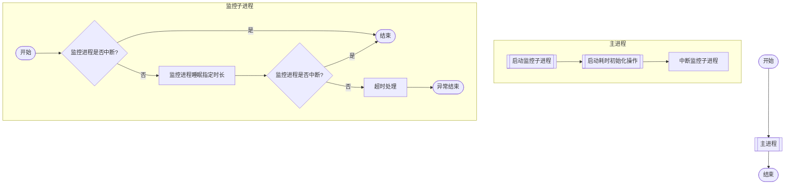

> 后端服务程序，通常会有一个初始化进程，用于加载服务配置、配置启动脚手架、启动监听程序等。这个初始化过程，通常不会耗时太久。但是如果初始化过程中发生了异常，可能会陷入一种异常场景，如死循环。因此配置一个后台监控程序，用于监控应用的初始化过程就十分必要了。

<!-- more -->
* TOC
{:toc}

## 说明

本文演示了多线程操作下，使用监控进程监控程序启动的例子。



关键点：

1. 在启动耗时操作进程前启动监控子进程；
2. 在耗时操作正常结束后需要中断监控子进程；
3. 监控子进程主要完成两个操作：
   1. 进入超时等待期；
   2. 超时等待期结束后判断当前进程是否已中断，如果中断则说明主进程加载正常，如果没中断则主进程加载超时。

使用 `java` 代码演示如下：

```java
package com.demo;

public class Run {

    private static final long TIMEOUT = 5L;
    private static final long DURING = 10L;

    public static void main(String[] args) {
        new Run().run();
    }

    private void run() {
        Thread daemonThread = daemonThread();
        try {
            Thread.sleep(DURING * 1000L);
        } catch (InterruptedException e) {
            e.printStackTrace();
        } finally {
            daemonThread.interrupt();
        }
        System.out.println("正常结束");
    }

    private Thread daemonThread() {
        Thread daemonThread = new Thread(() -> {
            // 启动监控进程
            if (!Thread.currentThread().isInterrupted()) {
                try {
                    Thread.sleep(TIMEOUT * 1000L);
                } catch (InterruptedException e) {
                    e.printStackTrace();
                }
                if (!Thread.currentThread().isInterrupted()) {
                    // 超时终止
                    System.out.println("timeout: 异常终止");
                    System.exit(1);
                }
            }
        });
        daemonThread.setDaemon(true);
        daemonThread.start();
        return daemonThread;
    }
}
```

*注：* `TIMEOUT > DURING`，程序正常运行至结束；`TIMEOUT < DURING` 时，程序超时退出。