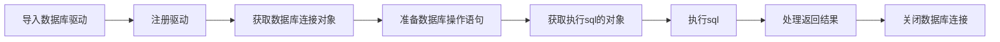

> 本文介绍 Java JDBC 到 ORM 框架的一步步进阶操作。

<!-- more -->
* TOC
{:toc}

## JDBC

JDBC 是 Java 操作数据库的基本规范，由 SUN 公司[^sun]定义。

JDBC 本质上就是一套操作所有关系型数据库的规则，SUN 公司制定了这套规则，各数据库厂商提供针对各自数据库的实现。

[^sun]: 已经被 ORACLE 公司收购

### 使用 JDBC 的基本步骤



JAVA 演示代码如下：

```java
package com.tjian;

import java.sql.Connection;
import java.sql.DriverManager;
import java.sql.PreparedStatement;
import java.sql.ResultSet;

public class Main {
    public static void main(String[] args) throws Exception {
        // 0. 导入驱动，已通过 maven 完成
        // 1. 加载驱动
        Class.forName("com.mysql.cj.jdbc.Driver");

        // 2. 获取连接
        String url = "jdbc:mysql://localhost:3306/my_db";
        Connection connection = DriverManager.getConnection(url, "root", "");

        // 3. 准备 sql
        String sql = "SELECT * FROM my_tab";

        // 4. 获取 sql 执行对象
        PreparedStatement preparedStatement = connection.prepareStatement(sql);

        // 5. 执行 sql
        ResultSet resultSet = preparedStatement.executeQuery();

        // 6. 处理执行结果
        if (resultSet !=null ) {
            while (resultSet.next()) {
                int id = resultSet.getInt(1);
                String name = resultSet.getString(2);
                System.out.println(id + " : " + name);
            }
            resultSet.close();
        }

        // 7. 关闭连接
        preparedStatement.close();
        connection.close();
    }
}
```

如果只是简单的测试数据库联通性，上述代码就够了。但实际项目中，肯定是需要对数据库表进行操作的。接下来看下对单个的数据库表的CURD操作代码。

### 基于 JDBC 的基本 CURD

JDBC 进阶优化，可以提取工具类（获取JDBC连接）、模型类和操作类Dao

#### 工具类

```java
package com.tjian.util;

import java.sql.Connection;
import java.sql.DriverManager;
import java.sql.SQLException;

public class DbUtil {

    private static final String DRIVER = "com.mysql.cj.jdbc.Driver";
    private static final String URL = "jdbc:mysql://localhost:3306/my_db";
    private static final String DB_USER = "root";
    private static final String DB_PASSWORD = "";

    public static Connection getConnection() {
        try {
            Class.forName(DRIVER);
            return DriverManager.getConnection(URL, DB_USER, DB_PASSWORD);
        } catch (ClassNotFoundException | SQLException e) {
            throw new RuntimeException(e);
        }
    }
}
```

#### 模型类

```java
package com.tjian.model;

import java.util.List;

public class User {

    private int id;

    private String name;

    public User() {
    }

    public User(String name) {
        this.name = name;
    }

    public User(int id, String name) {
        this.id = id;
        this.name = name;
    }

    public int getId() {
        return id;
    }

    public void setId(int id) {
        this.id = id;
    }

    public String getName() {
        return name;
    }

    public void setName(String name) {
        this.name = name;
    }

    @Override
    public String toString() {
        return "User{" +
                "id=" + id +
                ", name='" + name + '\'' +
                '}';
    }
}
```

#### Dao 类

```java
package com.tjian.dao;

import com.tjian.model.User;
import com.tjian.service.UserService;
import com.tjian.util.DbUtil;

import java.sql.Connection;
import java.sql.PreparedStatement;
import java.sql.ResultSet;
import java.sql.SQLException;
import java.util.ArrayList;
import java.util.List;

public class UserDao implements UserService {
    @Override
    public boolean save(User user) {
        try (Connection connection = DbUtil.getConnection();
            PreparedStatement preparedStatement = connection.prepareStatement("INSERT INTO my_tab(name) VALUES(?);");) {
            preparedStatement.setString(1, user.getName());

            int result = preparedStatement.executeUpdate();

            return result == 1;
        } catch (SQLException e) {
            throw new RuntimeException(e);
        }
    }

    @Override
    public boolean update(User user) {
        try (Connection connection = DbUtil.getConnection();
             PreparedStatement preparedStatement = connection.prepareStatement("UPDATE my_tab SET name = ? WHERE id = ?;");) {
            preparedStatement.setString(1, user.getName());
            preparedStatement.setInt(2, user.getId());

            int result = preparedStatement.executeUpdate();

            return result == 1;
        } catch (SQLException e) {
            throw new RuntimeException(e);
        }
    }

    @Override
    public boolean delete(int id) {
        try (Connection connection = DbUtil.getConnection();
             PreparedStatement preparedStatement = connection.prepareStatement("DELETE FROM my_tab WHERE id = ?;");) {
            preparedStatement.setInt(1, id);

            int result = preparedStatement.executeUpdate();

            return result == 1;
        } catch (SQLException e) {
            throw new RuntimeException(e);
        }
    }

    @Override
    public User getUser(int id) {
        try (Connection connection = DbUtil.getConnection();
             PreparedStatement preparedStatement = connection.prepareStatement("SELECT * FROM my_tab WHERE id = ?;");) {
            preparedStatement.setInt(1, id);

            ResultSet resultSet = preparedStatement.executeQuery();
            if (resultSet == null || !resultSet.next()) {
                return null;
            }

            return new User(resultSet.getInt(1), resultSet.getString(2));
        } catch (SQLException e) {
            throw new RuntimeException(e);
        }
    }

    @Override
    public User getUserByName(String name) {
        try (Connection connection = DbUtil.getConnection();
             PreparedStatement preparedStatement = connection.prepareStatement("SELECT * FROM my_tab WHERE name = ?;");) {
            preparedStatement.setString(1, name);

            ResultSet resultSet = preparedStatement.executeQuery();
            if (resultSet == null || !resultSet.next()) {
                return null;
            }

            User user = new User(resultSet.getInt(1), resultSet.getString(2));
            resultSet.close();

            return user;
        } catch (SQLException e) {
            throw new RuntimeException(e);
        }
    }

    @Override
    public List<User> getAll() {
        try (Connection connection = DbUtil.getConnection();
             PreparedStatement preparedStatement = connection.prepareStatement("SELECT * FROM my_tab");) {

            ResultSet resultSet = preparedStatement.executeQuery();

            if (resultSet == null) {
                return null;
            }

            List<User> users = new ArrayList<>();
            while (resultSet.next()) {
                users.add(new User(resultSet.getInt(1), resultSet.getString(2)));
            }
            resultSet.close();

            return users;
        } catch (SQLException e) {
            throw new RuntimeException(e);
        }
    }
}
```

如果数据库模型更多，我们可以进一步抽取泛型抽象类，用来减少重复代码逻辑。

### 基于 JDBC 的泛型 DAO 实现 CURD

我们抽取出来的泛型Dao类为抽象类，不可以直接实例化。

```java
package com.tjian.dao;

import com.tjian.model.Model;
import com.tjian.service.ModelService;
import com.tjian.util.DbUtil;

import java.sql.Connection;
import java.sql.PreparedStatement;
import java.sql.ResultSet;
import java.sql.SQLException;
import java.util.ArrayList;
import java.util.List;

public abstract class AbstractDao<M extends Model> implements ModelService<M> {

    @Override
    public boolean save(M model) {
        try (Connection connection = DbUtil.getConnection();
             PreparedStatement preparedStatement = connection.prepareStatement(saveSql(model))) {
            int result = preparedStatement.executeUpdate();
            return result == 1;
        } catch (SQLException e) {
            throw new RuntimeException(e);
        }
    }

    protected abstract String saveSql(M model);

    @Override
    public boolean update(M model) {
        try (Connection connection = DbUtil.getConnection();
             PreparedStatement preparedStatement = connection.prepareStatement(updateSql(model))) {
            int result = preparedStatement.executeUpdate();
            return result == 1;
        } catch (SQLException e) {
            throw new RuntimeException(e);
        }
    }

    protected abstract String updateSql(M model);

    @Override
    public boolean delete(int id) {
        try (Connection connection = DbUtil.getConnection();
             PreparedStatement preparedStatement = connection.prepareStatement(deleteSql(id))) {
            int result = preparedStatement.executeUpdate();
            return result == 1;
        } catch (SQLException e) {
            throw new RuntimeException(e);
        }
    }

    protected abstract String deleteSql(int id);

    @Override
    public M get(int id) {
        try (Connection connection = DbUtil.getConnection();
             PreparedStatement preparedStatement = connection.prepareStatement(getSql(id))) {
            ResultSet resultSet = preparedStatement.executeQuery();
            if (resultSet == null || !resultSet.next()) {
                return null;
            }

            return build(resultSet);
        } catch (SQLException e) {
            throw new RuntimeException(e);
        }
    }

    protected abstract String getSql(int id);

    protected abstract M build(ResultSet resultSet);

    @Override
    public List<M> getAll() {
        try (Connection connection = DbUtil.getConnection();
             PreparedStatement preparedStatement = connection.prepareStatement(getAllSql())) {
            ResultSet resultSet = preparedStatement.executeQuery();
            if (resultSet == null) {
                return null;
            }

            List<M> models = new ArrayList<>();
            while (resultSet.next()) {
                models.add(build(resultSet));
            }
            resultSet.close();

            return models;
        } catch (SQLException e) {
            throw new RuntimeException(e);
        }
    }

    protected String getAllSql() {
        return "SELECT * FROM " + entity.table();
    }
}
```

代码中出现的 Model 和 ModelService 用于统一最基本的 CURD 操作
